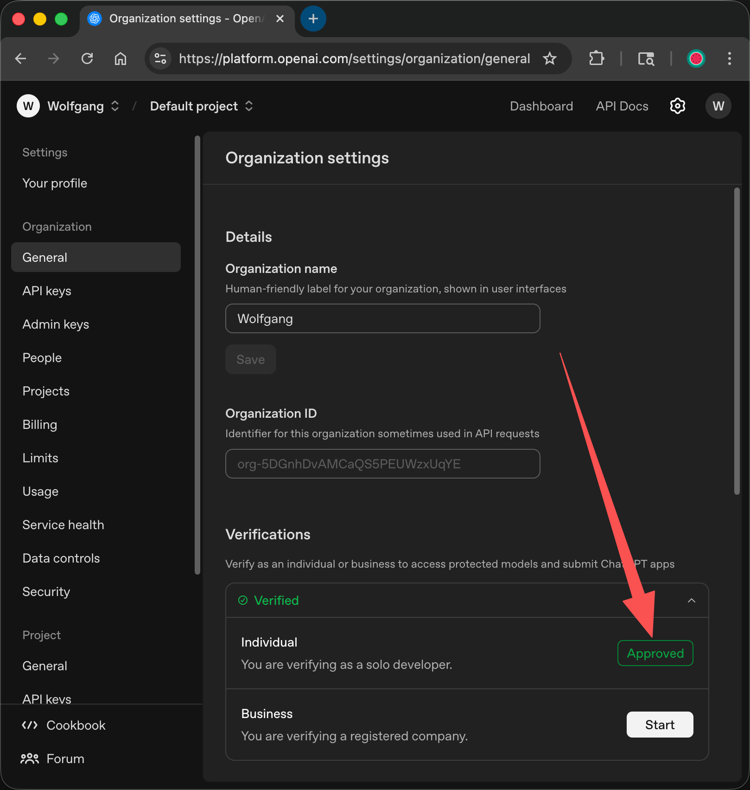

# Tutorial: KYC for a ChatGPT Account

This guide assumes you are using the Chrome web browser on a mobile phone.

## Step 1: Create an account

First, open Chrome and go to [https://chatgpt.com/](https://chatgpt.com/) to create a ChatGPT account.

## Step 2: Sign in and open the Settings page

- **2.1 Sign-in link**: In Chrome, sign in with your ChatGPT account using this link:  
  [https://platform.openai.com/settings/organization/general](https://platform.openai.com/settings/organization/general)

- **2.2 Open the same link again**: After you sign in, you may be sent to a different page. Copy the link below and open it again in the same Chrome browser:  
  [https://platform.openai.com/settings/organization/general](https://platform.openai.com/settings/organization/general)

## Step 3: Add a credit card on the Billing page and try to add money

On the Billing page, add a credit card with a $0 balance, then try to add $5. If it fails, refresh the Billing page in the same Chrome browser.

Example address:

```text
Name on card: Hello World
Country: United States of America
Address line 1: 4407 Argonne Street
City: Philadelphia
Postal Code: 19108
State: Delaware
```

## Step 4: Do KYC and choose Individual

In the same Chrome browser, open this link and choose **Individual** to do KYC:  
[https://platform.openai.com/settings/organization/general](https://platform.openai.com/settings/organization/general)

The screenshot below means KYC is done. Under `Verifications`, the `Individual` row shows `Approved`.



## Step 5: Remove the saved credit card

No matter if KYC succeeds or fails, go to **Payment methods** on the Billing page and remove the saved credit card.
